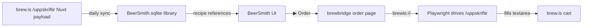

# brewbridge

Sync **brew.is** in-stock brewing ingredients into **BeerSmith 4**, import the brew.is recipe catalog, and fill the brew.is /uppskriftir Recipe Machine for any of your BeerSmith recipes with one click.

> An open-source bridge between [brew.is](https://www.brew.is/) (Iceland's homebrew shop) and [BeerSmith 4](https://www.beersmith.com/) on Windows.


---

## What it does

| | |
|---|---|
| 🛒 **Daily catalog sync** | Mirrors brew.is's in-stock grain / hops / yeast / misc into your BeerSmith ingredient libraries. Match by name with Icelandic→English phrase aliases and family-aware brewing logic. |
| 📋 **Recipe import** | Imports brew.is's 22 published recipes into BeerSmith with full grain/hop/yeast bills, BJCP styles, mash profiles, and source notes. |
| 🖱 **One-click order** | From any BeerSmith recipe, click **▶ Order at brew.is** in the custom report. Opens Chromium with the /uppskriftir Recipe Machine pre-filled — review, click Næsta skref, check out. |
| 🧪 **Substitution engine** | When something's missing or short at brew.is, suggest in-stock alternatives from the same brewing family (noble vs American C hops, base pilsner vs base pale ale, English ale vs lager yeast…) with pros/cons in Icelandic. |
| 🪞 **Try-before-you-buy** | One click clones a recipe in BeerSmith with the chosen substitution applied — see how OG/IBU/color shift before you commit. |
| 🩹 **Recipe audit** | Find and fix BeerSmith warnings on imported recipes: stale yeast dates, mash profile mismatches, water-chemistry gaps. |
| 🇮🇸 **Icelandic UI** | Reports, dialogs, and orders are localised. Buttons say "Búa til afrit" and "Næsta skref", not "Create copy" and "Next step". |

## Quick start (Windows, ~10 minutes)

**For non-Python users.** You'll need BeerSmith 4 installed and run at least once. brewbridge keeps your existing library intact by default — it only *adds* new `(brew.is)`-tagged rows alongside your current grains/hops/yeasts/misc.

1. **Download** `brewbridge-0.1.3.msi` from [Releases](https://github.com/Homeblest/brewbridge/releases) and double-click it.

   Windows SmartScreen will warn "Don't run" because the MSI isn't code-signed yet. Click **More info → Run anyway**. (It's open-source — you can inspect [exactly what it installs](src/brewbridge/setup.py).)

2. **Close BeerSmith** if it's open. Then open a PowerShell window and run:

   ```powershell
   brewbridge install
   ```

   This registers the `brewis://` URL handler, drops the BeerSmith report template, adds the `Brew.is einfaldur` mash profile and `Reykjavík tap` water profile to your BeerSmith library, and schedules a daily sync at 06:00.

3. **In BeerSmith**: `Tools → Options → Reports → Add Report…` → browse to `%APPDATA%\BeerSmith4\Reports\BrewIsOrder.htm` → set type to **Recipe** → save. (BeerSmith requires this go through its UI; we can't do it from outside the app.)

4. **First sync:**

   ```powershell
   brewbridge sync
   ```

   You'll see "inserted: N rows" — these are the brew.is ingredients in stock right now. Your existing custom ingredients are unchanged.

5. **Make a recipe.** In BeerSmith, create a new recipe and pick ingredients from your library. The brew.is items appear with a `(brew.is)` suffix in the name so you know they're orderable. Save the recipe.

6. **Order it.** Open the recipe, switch the view to the **BrewIsOrder** report, click **▶ Yfirfara og panta hjá brew.is**. brewbridge opens an HTML order sheet showing what to buy, total cost, and substitutions for anything currently out of stock.

7. **Verify everything's wired up:**

   ```powershell
   brewbridge doctor
   ```

   Should show 9 ✓ checks. Any ✗ explains how to fix.

**Daily life:** the tray icon (`brewbridge-tray` in Start Menu) auto-syncs every morning at 06:00 and turns red if sync ever fails. Right-click it for manual sync / order picker / open data folder.

### macOS

Status: code is platform-portable and the .app build pipeline is in place, but as of v0.1.3 it hasn't been verified on real Mac hardware. First-mover bug reports very welcome.

### From source (developers)

```powershell
git clone https://github.com/Homeblest/brewbridge.git
cd brewbridge
pip install -e .
playwright install chromium
brewbridge install        # registers protocol + report template + daily-sync task
brewbridge-tray           # starts the system-tray icon
```

See [INSTALL.md](INSTALL.md) for the detailed walkthrough including the brew.is-only / library-replace mode and uninstall steps.

### Power-user: brew.is-only library mode

By default, `brewbridge sync` adds `(brew.is)`-tagged items alongside your existing library. If you want the library to *only* contain brew.is items (so picking ingredients in BeerSmith only ever shows things you can buy), opt in:

```powershell
brewbridge sync --brew-is-only
```

This deletes every non-(brew.is) ingredient row before inserting the fresh catalog. A timestamped BeerSmith.sqlite backup is always taken to `%APPDATA%\BeerSmith4\brewbridge-backups\` first.

## How it works



* brew.is publishes its full product catalog as an embedded Nuxt payload on `/uppskriftir`. brewbridge fetches the page once a day, decodes the payload, filters in-stock ingredients, and writes them into BeerSmith's SQLite database as a managed "(brew.is)" library.
* The custom BeerSmith report attaches a `brewis://order/<recipe-name>` button. Clicking it routes through a registered Windows URL protocol to brewbridge, which generates an HTML shopping sheet AND drives the Recipe Machine via Playwright.
* A substitution engine kicks in for ingredients brew.is doesn't currently stock — same-family alternatives with attenuation / alpha / colour comparisons.

## Status

Early days. brew.is is the only supported supplier — the architecture is intentionally simple. If you want another shop bridged, the scraping logic is in [`src/brewbridge/suppliers/brewis.py`](src/brewbridge/suppliers/brewis.py) — open an issue or PR.

## License

MIT — see [LICENSE](LICENSE).

Not affiliated with brew.is or BeerSmith LLC. Built by a homebrewer scratching their own itch.
