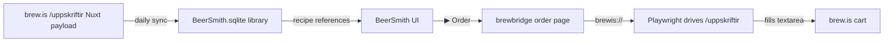

# brewbridge

Sync **brew.is** in-stock brewing ingredients into **BeerSmith 4**, import the brew.is recipe catalog, and fill the brew.is /uppskriftir Recipe Machine for any of your BeerSmith recipes with one click.

> An open-source bridge between [brew.is](https://www.brew.is/) (Iceland's homebrew shop) and [BeerSmith 4](https://www.beersmith.com/) on Windows.


---

## What it does

| | |
|---|---|
| 🛒 **Daily catalog sync** | Mirrors brew.is's in-stock grain / hops / yeast / misc into your BeerSmith ingredient libraries. Match by name with Icelandic→English phrase aliases and family-aware brewing logic. |
| 📋 **Recipe import** | Imports brew.is's 22 published recipes into BeerSmith with full grain/hop/yeast bills, BJCP styles, mash profiles, and source notes. |
| 🖱 **One-click order** | From any BeerSmith recipe, click **▶ Order at brew.is** in the custom report. Opens Chromium with the /uppskriftir Recipe Machine pre-filled — review, click Næsta skref, check out. |
| 🧪 **Substitution engine** | When something's missing or short at brew.is, suggest in-stock alternatives from the same brewing family (noble vs American C hops, base pilsner vs base pale ale, English ale vs lager yeast…) with pros/cons in Icelandic. |
| 🪞 **Try-before-you-buy** | One click clones a recipe in BeerSmith with the chosen substitution applied — see how OG/IBU/color shift before you commit. |
| 🩹 **Recipe audit** | Find and fix BeerSmith warnings on imported recipes: stale yeast dates, mash profile mismatches, water-chemistry gaps. |
| 🇮🇸 **Icelandic UI** | Reports, dialogs, and orders are localised. Buttons say "Búa til afrit" and "Næsta skref", not "Create copy" and "Next step". |

## Quick start

**Easiest** (Windows, non-Python users): download the MSI installer from [releases](https://github.com/hjaltileifsson/brewbridge/releases) and run it. The installer handles Python, the Chromium browser, the `brewis://` URL handler, and the BeerSmith report template.

**From source** (developers):

```powershell
git clone https://github.com/hjaltileifsson/brewbridge.git
cd brewbridge
pip install -e .
playwright install chromium
brewbridge install        # registers protocol + report template, seeds first sync
brewbridge-tray           # starts the system-tray icon
```

See [INSTALL.md](INSTALL.md) for the detailed walkthrough.

## How it works



* brew.is publishes its full product catalog as an embedded Nuxt payload on `/uppskriftir`. brewbridge fetches the page once a day, decodes the payload, filters in-stock ingredients, and writes them into BeerSmith's SQLite database as a managed "(brew.is)" library.
* The custom BeerSmith report attaches a `brewis://order/<recipe-name>` button. Clicking it routes through a registered Windows URL protocol to brewbridge, which generates an HTML shopping sheet AND drives the Recipe Machine via Playwright.
* A substitution engine kicks in for ingredients brew.is doesn't currently stock — same-family alternatives with attenuation / alpha / colour comparisons.

## Status

Early days. brew.is is the only supported supplier — the architecture is intentionally simple. If you want another shop bridged, the scraping logic is in [`src/brewbridge/suppliers/brewis.py`](src/brewbridge/suppliers/brewis.py) — open an issue or PR.

## License

MIT — see [LICENSE](LICENSE).

Not affiliated with brew.is or BeerSmith LLC. Built by a homebrewer scratching their own itch.
